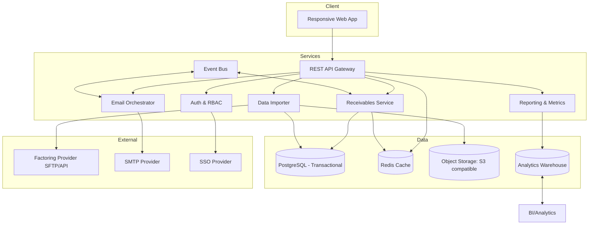
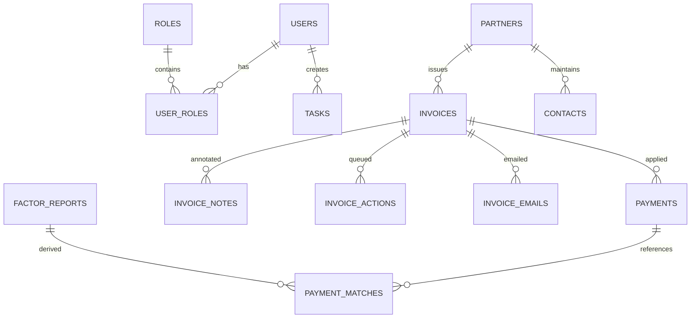
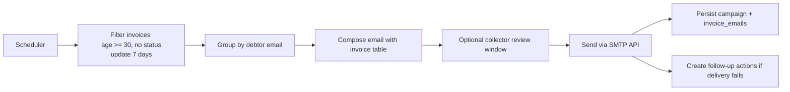

# Invoice Payment Tracking & Receivables Management Platform Specification

## 1. Vision & Guiding Principles
- **Purpose**: Replace the manual Google Sheets workflow with a unified, automation-first web platform that accelerates cash application, improves collector focus, and increases data confidence.
- **Design Ethos**: Minimalist, timeless, and functional—guided by Dieter Rams' principles. Every screen reduces visual noise, uses restrained color, and foregrounds hierarchy through typography and whitespace.
- **Key Outcomes**:
  - Same-day visibility into invoice status across factoring and direct payments.
  - Automated reminders and batching to eliminate manual follow-ups.
  - Streamlined reconciliation to cut unapplied cash and disputes.

## 2. High-Level Architecture

### Component Responsibilities
- **Web App**: Vue or React SPA with minimalist UI toolkit, SSR-enabled for performance.
- **API Gateway**: FastAPI or NestJS enforcing request validation, rate limits, and forwarding to services.
- **Auth & RBAC**: OAuth2/OIDC integration, JWT access tokens, policy-based access (admin, collector, analyst).
- **Receivables Service**: CRUD for invoices, partners, notes, reconciliation, action queues.
- **Data Importer**: Scheduled ingestion from factoring reports (CSV/XLSX via SFTP/API), normalization, and reconciliation.
- **Email Orchestrator**: Campaign scheduling, batching, and manual send workflows using templated content.
- **Reporting**: Materialized views for aging buckets, performance metrics, and dashboard APIs.
- **Event Bus**: Lightweight (e.g., AWS SNS/SQS or Kafka) to propagate status changes for real-time UI updates.

## 3. Data Model & Schema
Relational database (PostgreSQL). Naming uses snake_case. Timestamp fields capture `created_at`, `updated_at`, `deleted_at` (soft delete) where relevant.

### Entity Relationship Overview

### Table Specifications
#### `users`
- `id` (uuid, pk)
- `email` (unique)
- `password_hash` (nullable if SSO only)
- `full_name`
- `status` (enum: active, suspended)
- `last_login_at`

#### `roles`
- `id` (uuid, pk)
- `code` (enum: admin, collector, analyst, viewer)
- `description`

#### `user_roles`
- `user_id` fk `users`
- `role_id` fk `roles`
- unique composite

#### `partners`
- `id` (uuid, pk)
- `name`
- `credit_rating` (enum: A/B/C/D)
- `default_currency`
- `payment_terms_days`
- `average_days_to_pay`
- `notes`
- `status` (active/inactive)

#### `contacts`
- `id`
- `partner_id`
- `name`
- `role`
- `email`
- `phone`
- `is_primary`
- `validated_at` (null if never validated)

#### `invoices`
- `id`
- `partner_id`
- `debtor_name`
- `debtor_email_available` (boolean)
- `debtor_credit_rating`
- `invoice_number`
- `po_reference`
- `issue_date`
- `due_date`
- `original_amount`
- `currency`
- `status` (enum: open, in_dispute, paid, partially_paid, written_off)
- `current_status_note`
- `last_status_update_at`
- `priority_level` (enum: normal, high, urgent)
- `overdue_bucket` (enum: current, 1-30, 31-60, 61-90, 90+)
- `is_overdue`
- `overdue_reason`
- `manual_action_required` (boolean)
- `last_manual_action_at`
- `source` (enum: factoring, direct)
- `factoring_batch_id` (nullable)

Computed views handle daily aging: `invoice_age_days = current_date - issue_date`; `days_past_due = GREATEST(0, current_date - due_date)`.

#### `invoice_balances`
- `invoice_id` pk/fk
- `original_amount`
- `amount_paid`
- `amount_outstanding`
- `writeoff_amount`
- triggers maintain amounts on payment updates.

#### `invoice_notes`
- `id`
- `invoice_id`
- `user_id`
- `note`
- `note_type` (enum: phone_call, email, promise_to_pay, dispute, internal)
- `next_action_at`

#### `invoice_actions`
- `id`
- `invoice_id`
- `action_type` (enum: call, email, escalate, document_request, writeoff_review)
- `status` (pending, completed, skipped)
- `created_by`
- `assigned_to`
- `due_at`
- `completed_at`

#### `payments`
- `id`
- `invoice_id`
- `payment_reference`
- `payment_date`
- `amount`
- `currency`
- `method` (ach, wire, check, card, factoring)
- `source` (factoring_report, manual, import)
- `status` (unmatched, matched, reversed)

#### `payment_matches`
- `id`
- `payment_id`
- `factor_report_id`
- `matched_at`
- `match_confidence`
- `match_status` (auto_matched, needs_review)

#### `factor_reports`
- `id`
- `source_file`
- `report_date`
- `factoring_partner`
- `imported_at`
- `status` (processed, failed)
- `metadata` (JSONB)

#### `invoice_emails`
- `id`
- `invoice_id`
- `email_template`
- `sent_by` (user or system)
- `sent_at`
- `campaign_id`
- `delivery_status`
- `recipient`

#### `campaigns`
- `id`
- `name`
- `campaign_type` (automated_weekly, manual_batch)
- `scheduled_for`
- `sent_at`
- `status`
- `filters` (JSONB criteria)

#### `attachments`
- `id`
- `invoice_id`
- `file_url`
- `file_name`
- `uploaded_by`
- `uploaded_at`

#### `audit_logs`
- `id`
- `entity_type`
- `entity_id`
- `action`
- `payload`
- `performed_by`
- `performed_at`

## 4. API Specifications
RESTful endpoints; versioned `/api/v1`. JWT-secured. Representative endpoints below:

### Authentication
- `POST /auth/login` – email/password -> token.
- `POST /auth/refresh`
- `POST /auth/logout`
- `GET /auth/profile`

### Users & Roles
- `GET /users` (admin)
- `POST /users`
- `PATCH /users/{id}`
- `GET /roles`

### Partners & Contacts
- `GET /partners`
- `POST /partners`
- `GET /partners/{id}`
- `PATCH /partners/{id}`
- `GET /partners/{id}/contacts`
- `POST /partners/{id}/contacts`

### Invoices
- `GET /invoices` – filters: status, overdue_bucket, priority, partner_id, collector_id, aging range, manual_action_required.
- `POST /invoices`
- `GET /invoices/{id}`
- `PATCH /invoices/{id}`
- `POST /invoices/{id}/notes`
- `POST /invoices/{id}/actions`
- `PATCH /invoices/{id}/actions/{action_id}`
- `POST /invoices/{id}/emails`
- `GET /invoices/{id}/payments`
- Bulk operations: `POST /invoices/bulk/manual-action`, `POST /invoices/bulk/email`

### Payments & Matching
- `GET /payments`
- `POST /payments`
- `POST /payments/{id}/match`
- `GET /payment-matches`

### Imports & Reports
- `POST /imports/factoring` (upload CSV/XLSX)
- `GET /imports/factoring`
- `POST /imports/factoring/{id}/reprocess`

### Dashboard & Reporting
- `GET /dashboard/summary` (counts: total outstanding, DSO, collected last 7 days, actions due)
- `GET /dashboard/aging-buckets`
- `GET /reports/aging` (paginated grid)
- `GET /reports/chargebacks`
- `GET /reports/short-payments`
- `GET /reports/export` (CSV/XLSX)

### Campaigns & Email
- `GET /campaigns`
- `POST /campaigns` – create manual batches.
- `POST /campaigns/{id}/send`
- `POST /campaigns/{id}/cancel`
- `POST /campaigns/{id}/preview`

### Webhooks
- `POST /webhooks/email-status` – updates delivery/read status from provider.

## 5. Automation & Workflow Design

### Daily Jobs
1. **Aging Recalculation** – midnight in deployment timezone. Updates `overdue_bucket`, `is_overdue`, triggers notifications.
2. **Payment Auto-Matching** – after every factoring import; also hourly pass through unmatched payments using heuristics.

### Weekly Email Campaign (Monday 07:00 EDT)

- Intelligent batching merges invoices per debtor with templated table.
- Prioritize urgent invoices with separate template.
- Throttle per domain to avoid spam.

### Manual Email Workflow
- Collectors select invoices via checkboxes in grid.
- UI shows recipient suggestion, allows edit, attaches statements.
- Send triggers API to create campaign (type `manual_batch`).

### Payment Matching Logic
- Matching engine uses invoice number, amount, partner, and fuzzy match on references.
- Confidence scoring: >0.9 auto-apply, 0.6-0.9 queue for review, <0.6 flagged.
- Short-pay detection when payment < outstanding by tolerance (e.g., < -$5 difference or <2%). Creates dispute action.

## 6. User Interface Blueprint (Minimalist)
Use a monochrome palette with accent color for status, consistent spacing grid, typography (e.g., Inter or Helvetica). Layout uses cardless sections with subtle dividers.

### Screens
1. **Dashboard**
   - Hero metrics row: Outstanding, Collected MTD, Average Days Past Due, Items Requiring Action.
   - Aging donut chart, trend line for collections.
   - Priority list: top 10 urgent invoices with CTA.
   - Activity feed: latest notes/actions.

2. **Aging Report Workspace**
   - Full-width table with frozen header, zebra striping, inline filters (chips + search).
   - Columns: status flag, debtor, invoice #, PO, issue date, due date, age, bucket, amount original/paid/balance, priority, manual action checkbox, last note, collector.
   - Bulk action toolbar floats at bottom when rows selected.
   - Split drawer on the right for invoice detail (notes, actions, timeline) opening with subtle animation.

3. **Invoice Detail Drawer**
   - Summary top section with due status (colored pill) and quick stats.
   - Tabs: Activity, Payments, Emails, Documents.
   - Action buttons: Log Call, Send Email, Add Task.

4. **Payments & Reconciliation**
   - Table grouped by report batch with match confidence indicators.
   - Inline match suggestions, confirm button, short-pay highlight.

5. **Partners Directory**
   - Cardless list of partners with filters for credit rating and status.
   - Selecting partner opens detail page with contacts and performance metrics.

6. **Campaign Center**
   - Calendar view of scheduled campaigns.
   - Table of past sends with KPIs (sent, delivered, bounced, replied).
   - Detail modal to preview email content and associated invoices.

7. **Administration**
   - User management, role assignment.
   - System settings (email templates, aging thresholds, import schedules).

### Interaction Patterns
- Persistent left rail navigation, collapsible.
- Use consistent iconography (simple outlined icons).
- Confirmations via lightweight modals; destructive actions require double confirmation.
- Global search for invoices and partners.

## 7. Email Templates & Content Strategy
- Templates stored as MJML with variables: debtor_name, invoice_list, total_due, contact_info.
- Styling minimal, high contrast, includes company branding band at top.
- Automated campaigns use respectful tone, includes payment link or instructions.
- System logs open/click events via webhook to update invoice status.

## 8. Integration & Data Pipelines
- **Factoring Imports**: Support SFTP polling and API webhooks. Files parsed via serverless function (e.g., AWS Lambda) writing to staging tables.
- **Manual Upload**: UI drag-and-drop. Schema mapping wizard to align columns.
- **Warehouse Sync**: Nightly ELT to Snowflake/BigQuery for advanced analytics. dbt models produce curated marts.
- **Object Storage**: Store source reports and invoice documents (PDF) with signed URLs for access.

## 9. Security & Compliance
- RBAC enforced at API and database level via Row Level Security (RLS) for invoices scoped to assigned collectors.
- Audit logging for every change with immutable store (append-only table + optional external log).
- Encryption at rest (Postgres TDE or disk-level), TLS 1.2+ in transit.
- Secrets managed via Vault/Parameter Store.
- Email sending respects unsubscribe preferences and legal requirements.
- Backup strategy: Daily full backups, point-in-time recovery, disaster recovery region replication.

## 10. Scalability & Performance
- Horizontal scaling via container orchestration (Kubernetes). Autoscale web and worker pods.
- Redis caching for dashboard aggregates and session storage.
- Use background workers (Celery/Resque) for long-running tasks.
- Pagination and server-side filtering for large invoice sets (>100k records).
- WebSockets or Server-Sent Events for real-time updates of invoice status and payment matches.

## 11. Implementation Timeline
| Phase | Duration | Milestones |
| --- | --- | --- |
| Discovery & Design | 2 weeks | Requirements confirmation, stakeholder interviews, finalize UX wireframes. |
| Sprint 1 – Foundation | 3 weeks | Set up repo, CI/CD, auth service, base schema, seed data, minimal dashboard. |
| Sprint 2 – Invoices Core | 3 weeks | Invoice CRUD, aging calculations, detail drawer, notes/actions. |
| Sprint 3 – Payments & Matching | 3 weeks | Payment ingestion, matching engine, reconciliation UI. |
| Sprint 4 – Email Automation | 3 weeks | Campaign scheduler, templates, manual send, provider integration. |
| Sprint 5 – Imports & Reporting | 4 weeks | Factoring import pipeline, advanced reporting, export features. |
| Sprint 6 – Hardening & Launch | 2 weeks | Security review, performance testing, training, migration from Sheets. |

Total estimated timeline: **20 weeks**.

## 12. Technology Stack Recommendations
- **Frontend**: Vue 3 + Vite + TypeScript, Tailwind CSS (custom minimalist theme), Pinia for state, Axios for HTTP.
- **Backend**: Python FastAPI with SQLAlchemy, Celery for workers, Pydantic schemas.
- **Database**: PostgreSQL 15, Redis for cache/queues, dbt + Snowflake for analytics.
- **Infrastructure**: AWS (EKS, RDS, ElastiCache, S3, SES), Terraform for IaC, GitHub Actions CI/CD.
- **Monitoring**: Prometheus/Grafana, Sentry for error tracking, OpenTelemetry tracing.
- **Email**: AWS SES or SendGrid with webhooks.
- **Authentication**: Auth0 or Keycloak; support SSO (SAML/OIDC).

## 13. Migration Strategy
1. Export current Google Sheets as CSV.
2. Use migration scripts to load into staging tables.
3. Validate with stakeholders (spot-check totals, statuses).
4. Freeze spreadsheet edits during final migration window.
5. Run final import, backfill aging, and reconcile with factoring balances.
6. Conduct parallel run for one billing cycle before full cutover.

## 14. Testing & Quality Assurance
- **Unit Tests**: Services, utilities, Pydantic models.
- **Integration Tests**: API endpoints, RBAC rules, import pipelines.
- **E2E Tests**: Cypress UI flows (dashboard, manual email send, payment match).
- **Performance Tests**: Load test invoice grid with 250k records.
- **UAT**: Collectors validate workflows vs. current spreadsheet tasks.
- **Monitoring**: Synthetic checks for critical endpoints.

## 15. Documentation & Training
- Interactive product tour (e.g., Intro.js) on first login.
- Collector handbook with process diagrams.
- Admin guide for managing templates and imports.
- Recorded training sessions and searchable knowledge base.

## 16. Future Enhancements
- Predictive collections scoring (ML) using payment history.
- Customer portal for debtors to view/pay invoices.
- SMS notifications for urgent escalations.
- Dynamic promises-to-pay tracking with alerts.
- Integration with accounting ERP (e.g., NetSuite) for GL sync.

---
This specification provides a comprehensive blueprint to build a modern, scalable receivables platform while honoring the clarity and efficiency that the current spreadsheet workflow established.
